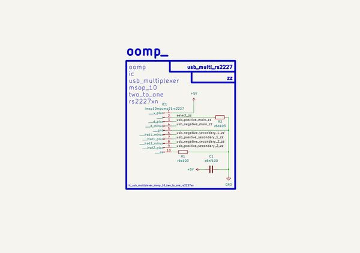
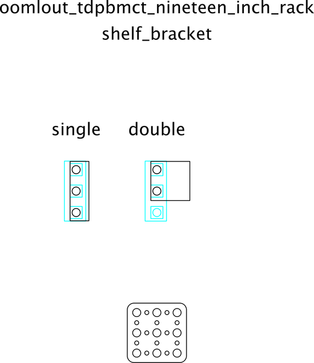

# SVG Component Placement in Kicad
Placing components along a path in Kicad.  
##notes  

## schematic  
  
[schematic (pdf)](kicad/current_version/working/working_schematic.pdf)  

## pcb  
  
    
  
  
[board (pdf)](kicad/current_version/working/working.pdf)  

## corel working
 

